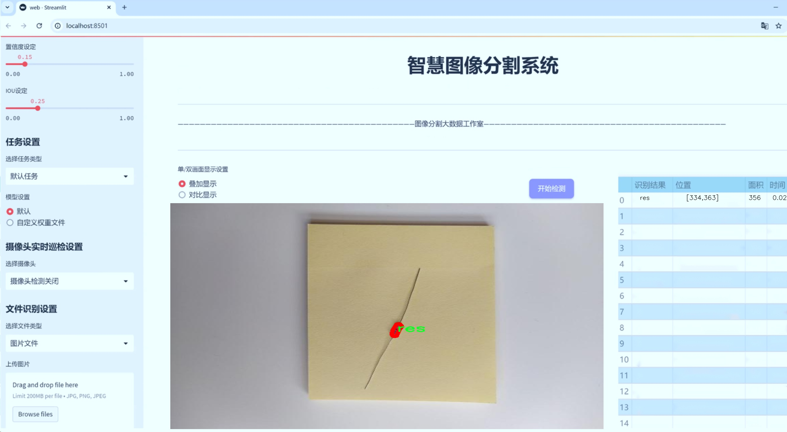

# 电阻器图像分割系统源码＆数据集分享
 [yolov8-seg-C2f-OREPA＆yolov8-seg-fasternet-bifpn等50+全套改进创新点发刊_一键训练教程_Web前端展示]

### 1.研究背景与意义

项目参考[ILSVRC ImageNet Large Scale Visual Recognition Challenge](https://gitee.com/YOLOv8_YOLOv11_Segmentation_Studio/projects)

项目来源[AAAI Global Al lnnovation Contest](https://kdocs.cn/l/cszuIiCKVNis)

研究背景与意义

随着电子技术的迅猛发展，电阻器作为电子元件中最基本且广泛应用的组成部分，其检测与分类的准确性对电子产品的质量控制和自动化生产具有重要意义。传统的电阻器检测方法多依赖人工视觉识别和简单的图像处理技术，这不仅效率低下，而且容易受到人为因素的影响，导致检测结果的不稳定性。因此，开发一种高效、准确的电阻器图像分割系统，能够显著提升电阻器的自动化检测水平，进而推动整个电子行业的智能化进程。

近年来，深度学习技术的快速发展为图像处理领域带来了革命性的变化，尤其是目标检测和图像分割技术的进步，使得计算机能够以更高的精度和效率完成复杂的视觉任务。YOLO（You Only Look Once）系列模型作为一种高效的实时目标检测算法，因其快速性和准确性而广泛应用于各类视觉识别任务。YOLOv8作为该系列的最新版本，结合了多种先进的网络结构和优化算法，具备了更强的特征提取能力和更快的推理速度。然而，针对特定应用场景，如电阻器的图像分割，YOLOv8仍然存在一定的局限性，特别是在细粒度分割和复杂背景下的物体识别方面。

本研究旨在基于改进的YOLOv8模型，构建一个高效的电阻器图像分割系统。为此，我们将利用一个包含1500张电阻器图像的数据集，该数据集分为两类：电阻器（res）和其他（resistor）。通过对该数据集的深入分析和处理，我们将针对电阻器的特征进行模型的优化与改进，以提高模型在实际应用中的表现。数据集的丰富性和多样性为模型的训练提供了良好的基础，使得模型能够在不同的环境和条件下，准确识别和分割电阻器。

本研究的意义不仅在于提升电阻器的检测精度，更在于推动智能制造和工业自动化的发展。通过实现电阻器的自动化分割与识别，可以大幅度降低人工成本，提高生产效率，确保产品质量的一致性。此外，该系统的成功应用还可以为其他电子元件的检测提供借鉴，具有广泛的推广价值。

综上所述，基于改进YOLOv8的电阻器图像分割系统的研究，不仅具有重要的理论价值，也具有显著的实际应用意义。通过该研究，我们期望能够为电阻器的自动化检测提供一种新思路，推动电子制造业的智能化转型，进而促进整个行业的可持续发展。

### 2.图片演示





##### 注意：由于此博客编辑较早，上面“2.图片演示”和“3.视频演示”展示的系统图片或者视频可能为老版本，新版本在老版本的基础上升级如下：（实际效果以升级的新版本为准）

  （1）适配了YOLOV8的“目标检测”模型和“实例分割”模型，通过加载相应的权重（.pt）文件即可自适应加载模型。

  （2）支持“图片识别”、“视频识别”、“摄像头实时识别”三种识别模式。

  （3）支持“图片识别”、“视频识别”、“摄像头实时识别”三种识别结果保存导出，解决手动导出（容易卡顿出现爆内存）存在的问题，识别完自动保存结果并导出到tempDir中。

  （4）支持Web前端系统中的标题、背景图等自定义修改，后面提供修改教程。

  另外本项目提供训练的数据集和训练教程,暂不提供权重文件（best.pt）,需要您按照教程进行训练后实现图片演示和Web前端界面演示的效果。

### 3.视频演示

[3.1 视频演示](https://www.bilibili.com/video/BV19qydYcEGB/)

### 4.数据集信息展示

##### 4.1 本项目数据集详细数据（类别数＆类别名）

nc: 2
names: ['res', 'resistor']


##### 4.2 本项目数据集信息介绍

数据集信息展示

在本研究中，我们采用了名为“detection_res”的数据集，以训练和改进YOLOv8-seg电阻器图像分割系统。该数据集专门设计用于电阻器的检测与分割任务，具有较高的实用价值和研究意义。数据集的类别数量为2，分别为“res”和“resistor”，这两个类别涵盖了电阻器的不同类型和形态，确保了模型在实际应用中的广泛适应性。

“detection_res”数据集的构建过程经过精心设计，旨在提供高质量的图像和标注信息，以便于深度学习模型的训练。数据集中包含了大量电阻器的图像，这些图像来源于不同的拍摄条件和背景，确保了数据的多样性和代表性。通过这种方式，模型能够学习到电阻器在各种环境下的特征，从而提高其分割精度和鲁棒性。

在数据集的标注过程中，采用了精确的像素级标注技术，为每一张图像中的电阻器提供了详细的分割边界。这种高精度的标注方式使得模型在训练时能够获得丰富的上下文信息，进而提升其对电阻器形状和位置的识别能力。数据集中的标注不仅包括电阻器的外轮廓，还考虑到了不同类型电阻器的细微差别，这为后续的模型优化提供了坚实的基础。

此外，数据集还考虑到了电阻器在实际应用中的多样性，包括不同颜色、大小和形状的电阻器。这种多样性使得模型在面对不同类型电阻器时，能够保持较高的识别率和分割效果。为了进一步增强模型的泛化能力，数据集中还引入了一些数据增强技术，如旋转、缩放、翻转等，这些技术可以有效增加训练样本的多样性，减少模型对特定样本的过拟合。

在训练过程中，我们将“detection_res”数据集与YOLOv8-seg模型相结合，利用其强大的特征提取和分割能力，旨在实现对电阻器的高效分割。通过不断迭代训练和优化，我们期望能够提升模型在电阻器图像分割任务中的表现，最终实现准确、高效的电阻器检测与分割。

综上所述，“detection_res”数据集为电阻器图像分割系统的训练提供了丰富而高质量的数据支持。通过精确的标注、多样的样本和有效的数据增强策略，该数据集不仅为YOLOv8-seg模型的训练奠定了坚实的基础，也为电阻器的自动检测与分割技术的发展提供了新的可能性。随着研究的深入，我们期待该数据集能够在电阻器图像处理领域发挥更大的作用，推动相关技术的进步与应用。


### 5.全套项目环境部署视频教程（零基础手把手教学）

[5.1 环境部署教程链接（零基础手把手教学）](https://www.bilibili.com/video/BV1jG4Ve4E9t/?vd_source=bc9aec86d164b67a7004b996143742dc)


[5.2 安装Python虚拟环境创建和依赖库安装视频教程链接（零基础手把手教学）](https://www.bilibili.com/video/BV1nA4VeYEze/?vd_source=bc9aec86d164b67a7004b996143742dc)

### 6.手把手YOLOV8-seg训练视频教程（零基础小白有手就能学会）

[6.1 手把手YOLOV8-seg训练视频教程（零基础小白有手就能学会）](https://www.bilibili.com/video/BV1cA4VeYETe/?vd_source=bc9aec86d164b67a7004b996143742dc)


按照上面的训练视频教程链接加载项目提供的数据集，运行train.py即可开始训练



     Epoch   gpu_mem       box       obj       cls    labels  img_size
     1/200     0G   0.01576   0.01955  0.007536        22      1280: 100%|██████████| 849/849 [14:42<00:00,  1.04s/it]
               Class     Images     Labels          P          R     mAP@.5 mAP@.5:.95: 100%|██████████| 213/213 [01:14<00:00,  2.87it/s]
                 all       3395      17314      0.994      0.957      0.0957      0.0843

     Epoch   gpu_mem       box       obj       cls    labels  img_size
     2/200     0G   0.01578   0.01923  0.007006        22      1280: 100%|██████████| 849/849 [14:44<00:00,  1.04s/it]
               Class     Images     Labels          P          R     mAP@.5 mAP@.5:.95: 100%|██████████| 213/213 [01:12<00:00,  2.95it/s]
                 all       3395      17314      0.996      0.956      0.0957      0.0845

     Epoch   gpu_mem       box       obj       cls    labels  img_size
     3/200     0G   0.01561    0.0191  0.006895        27      1280: 100%|██████████| 849/849 [10:56<00:00,  1.29it/s]
               Class     Images     Labels          P          R     mAP@.5 mAP@.5:.95: 100%|███████   | 187/213 [00:52<00:00,  4.04it/s]
                 all       3395      17314      0.996      0.957      0.0957      0.0845


### 7.50+种全套YOLOV8-seg创新点代码加载调参视频教程（一键加载写好的改进模型的配置文件）

[7.1 50+种全套YOLOV8-seg创新点代码加载调参视频教程（一键加载写好的改进模型的配置文件）](https://www.bilibili.com/video/BV1Hw4VePEXv/?vd_source=bc9aec86d164b67a7004b996143742dc)

### 8.YOLOV8-seg图像分割算法原理

原始YOLOv8-seg算法原理

YOLOv8-seg是2023年1月10日发布的YOLO系列最新版本，代表了计算机视觉领域在目标检测、图像分割和分类任务上的一项重大进步。作为YOLO系列的最新王者，YOLOv8在精度和执行时间方面均超越了现有的所有模型，成为实时目标检测和实例分割任务的首选方案。该模型不仅借鉴了YOLOv5、YOLOv6和YOLOX等前辈的设计优点，还在此基础上进行了全面的结构优化，旨在提升模型的性能和易用性。

YOLOv8的设计理念基于快速、准确和简洁的原则，使其在实际应用中具有广泛的适用性。模型的核心结构主要由三个部分组成：骨干特征提取网络、特征融合层和检测头层。骨干网络的改进是YOLOv8的一大亮点，采用了新的C2F模块替代了YOLOv5中的C3模块。这一变化不仅提高了特征提取的效率，还增强了模型的表达能力。C2F模块通过并行的梯度流分支，能够在保持轻量化的同时，获取更丰富的特征信息，从而提升检测精度。

在特征融合层，YOLOv8结合了特征金字塔网络（FPN）和路径聚合网络（PAN），通过双向跨尺度连接和加权特征融合的方式，提高了对不同尺度特征信息的提取速度。这种设计使得YOLOv8在处理多尺度目标时表现得更加灵活和高效，能够有效应对小目标检测和高分辨率图像的挑战。

YOLOv8的检测头部分则是其最大的创新之一。模型从原先的耦合头（Coupled-Head）转变为解耦头（Decoupled-Head），将目标检测和分类任务分开处理。解耦头的设计使得分类和边界框回归的卷积操作不再共享同一层，从而提高了模型的训练效率和预测精度。此外，YOLOv8采用了无锚框（Anchor-Free）的方法，摒弃了传统的基于锚框的目标检测思路。这一创新使得模型在训练时不再需要预设锚框，简化了模型结构，提高了泛化能力。

在损失函数的设计上，YOLOv8也进行了重要的改进。取消了物体存在性分支（Objectness branch），并在分类分支中使用了二值交叉熵损失（BCELoss），而在边界框回归分支中则引入了分布焦点损失（DFL）和CIoU损失。这种损失函数的组合旨在加速模型对标签附近的数值聚焦，提高了模型在目标检测中的准确性。

YOLOv8在输入处理方面也展现了其灵活性。模型默认输入图像尺寸为640x640，但在实际应用中，YOLOv8能够自适应地对不同长宽比的图像进行缩放处理。这种自适应缩放策略有效减少了信息冗余，提高了目标检测和推理的速度。同时，YOLOv8在训练过程中引入了Mosaic图像增强技术，通过随机拼接多张图像，迫使模型学习到更多的上下文信息，从而提升了模型的鲁棒性和预测精度。

在整体架构上，YOLOv8的设计充分考虑了工程化的简洁性与易用性，使得开发者能够更快速地进行模型的部署与应用。其轻量化的特性使得YOLOv8能够在多种硬件平台上高效运行，从CPU到GPU的适配性使得该模型在实际应用中具备了更高的灵活性。

综上所述，YOLOv8-seg算法通过对骨干网络、特征融合层和检测头的创新设计，显著提升了目标检测和图像分割的性能。其无锚框的检测策略、解耦的输出结构以及灵活的输入处理方式，使得YOLOv8在实时目标检测和实例分割任务中表现出色，成为当前计算机视觉领域的一个重要里程碑。随着YOLOv8的推广和应用，预计将会在各类实际场景中发挥越来越重要的作用，推动计算机视觉技术的进一步发展。


### 9.系统功能展示（检测对象为举例，实际内容以本项目数据集为准）

图9.1.系统支持检测结果表格显示

  图9.2.系统支持置信度和IOU阈值手动调节

  图9.3.系统支持自定义加载权重文件best.pt(需要你通过步骤5中训练获得)

  图9.4.系统支持摄像头实时识别

  图9.5.系统支持图片识别

  图9.6.系统支持视频识别

  图9.7.系统支持识别结果文件自动保存

  图9.8.系统支持Excel导出检测结果数据


### 10.50+种全套YOLOV8-seg创新点原理讲解（非科班也可以轻松写刊发刊，V11版本正在科研待更新）

#### 10.1 由于篇幅限制，每个创新点的具体原理讲解就不一一展开，具体见下列网址中的创新点对应子项目的技术原理博客网址【Blog】：


[10.1 50+种全套YOLOV8-seg创新点原理讲解链接](https://gitee.com/qunmasj/good)

#### 10.2 部分改进模块原理讲解(完整的改进原理见上图和技术博客链接)【如果此小节的图加载失败可以通过CSDN或者Github搜索该博客的标题访问原始博客，原始博客图片显示正常】
### YOLOv8简介
YOLO（You Only Look Once）是一种流行的对象检测和图像分割模型，由华盛顿大学的Joseph Redmon和Ali Farhadi开发。YOLO于2015年推出，以其高速度和高精度迅速走红。

YOLOv2于2016年发布，通过合并批处理规范化、锚盒和维度集群来改进原始模型
2018年推出的YOLOv3使用更高效的骨干网络、多个锚点和空间金字塔池进一步增强了该模型的性能
YOLOv4于2020年发布，引入了Mosaic数据增强、新的无锚检测头和新的丢失功能等创新
YOLOv5进一步提高了模型的性能，并添加了超参数优化、集成实验跟踪和自动导出到流行导出格式等新功能
YOLOv6于2022年由美团开源，目前正在该公司的许多自动配送机器人中使用
YOLOv7在COCO关键点数据集上添加了额外的任务，如姿态估计
YOLOv8是Ultralytics公司推出的YOLO的最新版本。作为一款尖端、最先进的（SOTA）车型，YOLOv8在之前版本的成功基础上，引入了新的功能和改进，以增强性能、灵活性和效率。YOLOv8支持全方位的视觉AI任务，包括检测、分割、姿态估计、跟踪和分类。这种多功能性允许用户在不同的应用程序和域中利用YOLOv8的功能
#### YOLOv8的新特性与可用模型

Ultralytics 并没有直接将开源库命名为 YOLOv8，而是直接使用 ultralytics 这个词，原因是 ultralytics 将这个库定位为算法框架，而非某一个特定算法，一个主要特点是可扩展性。其希望这个库不仅仅能够用于 YOLO 系列模型，而是能够支持非 YOLO 模型以及分类分割姿态估计等各类任务。总而言之，ultralytics 开源库的两个主要优点是：

融合众多当前 SOTA 技术于一体
未来将支持其他 YOLO 系列以及 YOLO 之外的更多算法
Ultralytics为YOLO模型发布了一个全新的存储库。它被构建为 用于训练对象检测、实例分割和图像分类模型的统一框架。

提供了一个全新的 SOTA 模型，包括 P5 640 和 P6 1280 分辨率的目标检测网络和基于 YOLACT 的实例分割模型。和 YOLOv5 一样，基于缩放系数也提供了 N/S/M/L/X 尺度的不同大小模型，用于满足不同场景需求
骨干网络和 Neck 部分可能参考了 YOLOv7 ELAN 设计思想，将 YOLOv5 的 C3 结构换成了梯度流更丰富的 C2f 结构，并对不同尺度模型调整了不同的通道数，属于对模型结构精心微调，不再是无脑一套参数应用所有模型，大幅提升了模型性能。不过这个 C2f 模块中存在 Split 等操作对特定硬件部署没有之前那么友好了
Head 部分相比 YOLOv5 改动较大，换成了目前主流的解耦头结构，将分类和检测头分离，同时也从 Anchor-Based 换成了 Anchor-Free
Loss 计算方面采用了 TaskAlignedAssigner 正样本分配策略，并引入了 Distribution Focal Loss
训练的数据增强部分引入了 YOLOX 中的最后 10 epoch 关闭 Mosiac 增强的操作，可以有效地提升精度
YOLOv8 还高效灵活地支持多种导出格式，并且该模型可以在 CPU 和 GPU 上运行。YOLOv8 模型的每个类别中有五个模型用于检测、分割和分类。YOLOv8 Nano 是最快和最小的，而 YOLOv8 Extra Large (YOLOv8x) 是其中最准确但最慢的。


### FocalModulation模型的基本原理
参考该博客，Focal Modulation Networks（FocalNets）的基本原理是替换自注意力（Self-Attention）模块，使用焦点调制（focal modulation）机制来捕捉图像中的长距离依赖和上下文信息。下图是自注意力和焦点调制两种方法的对比。


自注意力要求对每个查询令牌（Query Token）与其他令牌进行复杂的查询-键（Query-Key）交互和查询-值（Query-Value）聚合，以计算注意力分数并捕捉上下文。而焦点调制则先将空间上下文以不同粒度聚合到调制器中，然后以查询依赖的方式将这些调制器注入到查询令牌中。焦点调制简化了交互和聚合操作，使其更轻量级。在图中，自注意力部分使用红色虚线表示查询-键交互和黄色虚线表示查询-值聚合，而焦点调制部分则用蓝色表示调制器聚合和黄色表示查询-调制器交互。 

FocalModulation模型通过以下步骤实现：

1. 焦点上下文化：用深度卷积层堆叠来编码不同范围的视觉上下文。


2. 门控聚合：通过门控机制，选择性地将上下文信息聚合到每个查询令牌的调制器中。


3. 逐元素仿射变换：将聚合后的调制器通过仿射变换注入到每个查询令牌中。

下面来分别介绍这三个机制->

#### 焦点上下文化
焦点上下文化（Focal Contextualization）是焦点调制（Focal Modulation）的一个组成部分。焦点上下文化使用一系列深度卷积层（depth-wise convolutional layers）来编码不同范围内的视觉上下文信息。这些层可以捕捉从近处到远处的视觉特征，从而允许网络在不同层次上理解图像内容。通过这种方式，网络能够在聚合上下文信息时保持对局部细节的敏感性，并增强对全局结构的认识。


​

这张图详细比较了自注意力（Self-Attention, SA）和焦点调制（Focal Modulation）的机制，并特别展示了焦点调制中的上下文聚合过程。左侧的图展示了自注意力模型如何通过键（k）和查询（q）之间的交互，以及随后的聚合来生成输出。而中间和右侧的图说明了焦点调制如何通过层级化的上下文聚合和门控聚合过程替代自注意力模型的这一过程。在焦点调制中，输入首先通过轻量级线性层进行处理，然后通过层级化的上下文化模块和门控机制来选择性地聚合信息，最终通过调制器与查询（q）进行交互以生成输出。

#### 门控聚合
在Focal Modulation Networks（FocalNets）中的 "门控聚合"（Gated Aggregation）是关键组件之一，这一过程涉及使用门控机制来选择性地聚合上下文信息。以下是这个过程的详细分析：

1. 什么是门控机制？
门控机制在深度学习中常用于控制信息流。它通常用于决定哪些信息应该被传递，哪些应该被阻断。在循环神经网络（RNN）中，特别是在长短期记忆网络（LSTM）和门控循环单元（GRU）中，门控机制用于调节信息在时间序列数据中的流动。

2. 门控聚合的目的
在FocalNets中，门控聚合的目的是为每个查询令牌（即处理中的数据单元）选择性地聚合上下文信息。这意味着网络能够决定哪些特定的上下文信息对于当前处理的查询令牌是重要的，从而专注于那些最相关的信息。

3. 如何实现门控聚合？
实现门控聚合可能涉及一系列计算步骤，其中包括：

计算上下文信息：这可能涉及使用深度卷积层（如文中提到的）对输入图像的不同区域进行编码，以捕捉从局部到全局的视觉上下文。
门控操作：这一步骤涉及到一个决策过程，根据当前查询令牌的特征来决定哪些上下文信息是相关的。这可能通过一个学习到的权重（门）来实现，该权重决定了不同上下文信息的重要性。
信息聚合：最后，根据门控操作的结果，选择性地聚合上下文信息到一个调制器中。这个调制器随后被用于调整或“调制”查询令牌的表示。
4. 门控聚合的好处
通过门控聚合，FocalNets能够更有效地聚焦于对当前任务最关键的信息。这种方法提高了模型的效率和性能，因为它减少了不必要信息的处理，同时增强了对关键特征的关注。在视觉任务中，这可能意味着更好的目标检测和图像分类性能，特别是在复杂或多变的视觉环境中。

总结：门控聚合是FocalNets的一个核心组成部分，它通过选择性地集中处理重要的上下文信息来提升网络的效率和性能。

#### 逐元素仿射变换
在Focal Modulation Networks（FocalNets）中的第三个关键组件是逐元素仿射变换，这个步骤涉及将通过门控聚合得到的调制器注入到每个查询令牌中。以下是该过程的详细分析：

1. 仿射变换的基本概念：
仿射变换是一种线性变换，用于对数据进行缩放、旋转、平移和倾斜等操作。在深度学习中，逐元素的仿射变换通常指的是对每个元素进行线性变换，这种变换可以被描述为y = ax + b，其中x是输入，y是输出，a和b是变换的参数。

2. 逐元素仿射变换的作用：
在FocalNets中，逐元素仿射变换的作用是将聚合后的调制器信息注入到每个查询令牌中。这个步骤对于整合上下文信息和查询令牌的原始特征非常重要。通过这种方式，调制器所包含的上下文信息可以直接影响查询令牌的表示。

3. 执行仿射变换：
执行这一步骤时，聚合后的调制器对每个查询令牌进行逐元素的仿射变换。在实践中，这可能意味着对查询令牌的每个特征应用调制器中的相应权重（a）和偏差（b）。这样，调制器中的每个元素都直接对应于查询令牌的一个特征，通过调整这些特征来改变其表达。

4. 仿射变换的效果：
通过逐元素仿射变换，模型能够更细致地调整每个查询令牌的特征，根据上下文信息来增强或抑制某些特征。这种精细的调整机制允许网络更好地适应复杂的视觉场景，提高对细节的捕捉能力，从而提升了模型在各种视觉任务中的性能，如目标检测和图像分类。

总结：逐元素仿射变换它使得模型能够利用上下文信息来有效地调整查询令牌，增强了模型对关键视觉特征的捕捉和表达能力。


### 11.项目核心源码讲解（再也不用担心看不懂代码逻辑）

#### 11.1 ui.py

以下是经过简化和注释的核心代码部分：

```python
import sys
import subprocess

def run_script(script_path):
    """
    使用当前 Python 环境运行指定的脚本。

    Args:
        script_path (str): 要运行的脚本路径
    """
    # 获取当前 Python 解释器的路径
    python_path = sys.executable

    # 构建运行命令，使用 streamlit 运行指定的脚本
    command = f'"{python_path}" -m streamlit run "{script_path}"'

    # 执行命令并等待其完成
    result = subprocess.run(command, shell=True)
    
    # 检查命令执行结果，如果返回码不为0，表示出错
    if result.returncode != 0:
        print("脚本运行出错。")

# 程序入口
if __name__ == "__main__":
    # 指定要运行的脚本路径
    script_path = "web.py"  # 这里可以直接指定脚本名称

    # 调用函数运行脚本
    run_script(script_path)
```

### 代码说明：
1. **导入模块**：
   - `sys`：用于获取当前 Python 解释器的路径。
   - `subprocess`：用于执行外部命令。

2. **`run_script` 函数**：
   - 接受一个参数 `script_path`，表示要运行的脚本路径。
   - 使用 `sys.executable` 获取当前 Python 解释器的路径。
   - 构建一个命令字符串，用于运行 `streamlit` 以及指定的脚本。
   - 使用 `subprocess.run` 执行命令，并等待其完成。
   - 检查命令的返回码，如果不为0，则打印错误信息。

3. **程序入口**：
   - 使用 `if __name__ == "__main__":` 确保只有在直接运行该脚本时才会执行以下代码。
   - 指定要运行的脚本名称 `web.py`。
   - 调用 `run_script` 函数来执行该脚本。

这个文件名为 `ui.py`，它的主要功能是通过当前的 Python 环境来运行一个指定的脚本，具体是一个名为 `web.py` 的文件。文件中首先导入了必要的模块，包括 `sys`、`os` 和 `subprocess`，以及一个自定义的路径处理函数 `abs_path`，这个函数来自于 `QtFusion.path` 模块。

在 `run_script` 函数中，首先获取当前 Python 解释器的路径，这通过 `sys.executable` 实现。接着，构建一个命令字符串，这个命令用于运行 `streamlit`，一个用于构建和共享数据应用的框架。命令的格式是 `"{python_path}" -m streamlit run "{script_path}"`，其中 `python_path` 是当前 Python 解释器的路径，`script_path` 是要运行的脚本的路径。

然后，使用 `subprocess.run` 方法来执行这个命令。这个方法会在一个新的进程中运行命令，并等待其完成。如果命令执行的返回码不为 0，表示脚本运行过程中出现了错误，程序会打印出“脚本运行出错”的提示信息。

在文件的最后部分，使用 `if __name__ == "__main__":` 来判断是否是直接运行该脚本。如果是，程序会调用 `abs_path` 函数来获取 `web.py` 的绝对路径，并将其传递给 `run_script` 函数，从而启动这个脚本。

总体来说，这个程序的功能是封装了一个简单的命令行接口，用于启动一个基于 Streamlit 的 Web 应用，确保了可以在当前 Python 环境中正确运行指定的脚本。

#### 11.2 ultralytics\models\fastsam\__init__.py

以下是代码中最核心的部分，并附上详细的中文注释：

```python
# 导入所需的模块和类
from .model import FastSAM  # 导入FastSAM模型类
from .predict import FastSAMPredictor  # 导入FastSAMPredictor类，用于进行预测
from .prompt import FastSAMPrompt  # 导入FastSAMPrompt类，用于处理提示信息
from .val import FastSAMValidator  # 导入FastSAMValidator类，用于验证模型性能

# 定义模块的公开接口，允许外部访问这些类
__all__ = 'FastSAMPredictor', 'FastSAM', 'FastSAMPrompt', 'FastSAMValidator'
```

### 详细注释说明：
1. **模块导入**：
   - `from .model import FastSAM`：从当前包的`model`模块中导入`FastSAM`类，`FastSAM`可能是一个用于构建和训练模型的类。
   - `from .predict import FastSAMPredictor`：从`predict`模块中导入`FastSAMPredictor`类，该类负责使用训练好的模型进行预测。
   - `from .prompt import FastSAMPrompt`：从`prompt`模块中导入`FastSAMPrompt`类，该类可能用于处理用户输入或提示信息，以便更好地与模型交互。
   - `from .val import FastSAMValidator`：从`val`模块中导入`FastSAMValidator`类，该类用于评估模型的性能和准确性。

2. **公开接口定义**：
   - `__all__`：这是一个特殊变量，用于定义模块的公共接口。当使用`from module import *`语句时，只有在`__all__`中列出的名称会被导入。这有助于控制模块的可见性，避免不必要的名称冲突。这里定义了四个类作为模块的公共接口。

这个程序文件是一个Python模块的初始化文件，通常用于定义模块的公共接口。在这个文件中，首先通过注释说明了该模块属于Ultralytics YOLO项目，并且使用的是AGPL-3.0许可证。

接下来，文件从同一目录下导入了四个类或函数：`FastSAM`、`FastSAMPredictor`、`FastSAMPrompt`和`FastSAMValidator`。这些导入的内容分别来自于模块中的不同文件，具体来说：

- `FastSAM` 可能是一个与FastSAM模型相关的类或函数，负责模型的定义和实现。
- `FastSAMPredictor` 是一个预测器类，可能用于对输入数据进行预测，输出模型的结果。
- `FastSAMPrompt` 可能与用户输入或提示相关，提供了一种与模型交互的方式。
- `FastSAMValidator` 可能用于验证模型的性能或准确性，确保模型在给定数据集上的表现符合预期。

最后，`__all__` 变量定义了模块的公共接口，指定了在使用 `from module import *` 语句时，哪些名称会被导入。这里列出的四个名称都是模块的主要组成部分，表明它们是用户在使用这个模块时最常用的功能或类。

总的来说，这个初始化文件的作用是组织和导出模块的主要功能，使得用户可以方便地访问和使用这些功能。

#### 11.3 ultralytics\models\nas\__init__.py

以下是保留的核心代码部分，并附上详细的中文注释：

```python
# 导入所需的模块和类
from .model import NAS  # 从当前包的model模块中导入NAS类
from .predict import NASPredictor  # 从当前包的predict模块中导入NASPredictor类
from .val import NASValidator  # 从当前包的val模块中导入NASValidator类

# 定义当前模块的公开接口，只有列出的类可以被外部访问
__all__ = 'NASPredictor', 'NASValidator', 'NAS'
```

### 代码注释说明：
1. **导入模块**：
   - `from .model import NAS`：这行代码从当前包的`model`模块中导入`NAS`类，`NAS`可能是一个与神经架构搜索（Neural Architecture Search）相关的模型类。
   - `from .predict import NASPredictor`：这行代码从当前包的`predict`模块中导入`NASPredictor`类，`NASPredictor`可能是用于进行预测的类。
   - `from .val import NASValidator`：这行代码从当前包的`val`模块中导入`NASValidator`类，`NASValidator`可能是用于验证模型性能的类。

2. **定义公开接口**：
   - `__all__ = 'NASPredictor', 'NASValidator', 'NAS'`：这行代码定义了当前模块的公开接口，只有在`__all__`中列出的类可以被外部导入。这样做的目的是为了控制模块的导出内容，避免不必要的内部实现细节被外部访问。

这个程序文件是Ultralytics YOLO项目中的一个初始化文件，位于`ultralytics\models\nas\`目录下。文件的主要功能是定义该模块的公共接口。

首先，文件顶部的注释表明该项目使用的是AGPL-3.0许可证，并且是Ultralytics YOLO的一个部分。接下来，文件通过`from .model import NAS`、`from .predict import NASPredictor`和`from .val import NASValidator`这三行代码导入了三个类或模块：`NAS`、`NASPredictor`和`NASValidator`。这些类或模块分别来自于同一目录下的`model.py`、`predict.py`和`val.py`文件。

最后，`__all__`变量被定义为一个元组，包含了字符串`'NASPredictor'`、`'NASValidator'`和`'NAS'`。这个变量的作用是指定当使用`from module import *`语句时，哪些名称是可以被导入的。这意味着只有这三个名称会被暴露给外部使用者，从而控制模块的公共接口，避免不必要的名称冲突或误用。

总的来说，这个初始化文件的作用是将该模块的核心功能和类集中在一起，方便其他模块或用户进行导入和使用。

#### 11.4 ultralytics\models\yolo\classify\val.py

以下是代码中最核心的部分，并附上详细的中文注释：

```python
import torch
from ultralytics.data import ClassificationDataset, build_dataloader
from ultralytics.engine.validator import BaseValidator
from ultralytics.utils.metrics import ClassifyMetrics, ConfusionMatrix
from ultralytics.utils.plotting import plot_images

class ClassificationValidator(BaseValidator):
    """
    ClassificationValidator类用于基于分类模型的验证。
    """

    def __init__(self, dataloader=None, save_dir=None, pbar=None, args=None, _callbacks=None):
        """初始化ClassificationValidator实例，设置数据加载器、保存目录、进度条和参数。"""
        super().__init__(dataloader, save_dir, pbar, args, _callbacks)
        self.targets = None  # 真实标签
        self.pred = None     # 预测结果
        self.args.task = 'classify'  # 设置任务类型为分类
        self.metrics = ClassifyMetrics()  # 初始化分类指标

    def init_metrics(self, model):
        """初始化混淆矩阵、类名以及top-1和top-5准确率。"""
        self.names = model.names  # 获取类名
        self.nc = len(model.names)  # 类别数量
        self.confusion_matrix = ConfusionMatrix(nc=self.nc, conf=self.args.conf, task='classify')  # 初始化混淆矩阵
        self.pred = []  # 存储预测结果
        self.targets = []  # 存储真实标签

    def preprocess(self, batch):
        """预处理输入批次并返回处理后的批次。"""
        batch['img'] = batch['img'].to(self.device, non_blocking=True)  # 将图像移动到设备上
        batch['img'] = batch['img'].half() if self.args.half else batch['img'].float()  # 根据参数选择数据类型
        batch['cls'] = batch['cls'].to(self.device)  # 将标签移动到设备上
        return batch

    def update_metrics(self, preds, batch):
        """使用模型预测和批次目标更新运行指标。"""
        n5 = min(len(self.names), 5)  # 取前5个预测结果
        self.pred.append(preds.argsort(1, descending=True)[:, :n5])  # 将预测结果按降序排序并取前n5
        self.targets.append(batch['cls'])  # 存储真实标签

    def finalize_metrics(self, *args, **kwargs):
        """最终化模型的指标，如混淆矩阵和速度。"""
        self.confusion_matrix.process_cls_preds(self.pred, self.targets)  # 处理预测和真实标签以更新混淆矩阵
        self.metrics.speed = self.speed  # 记录速度
        self.metrics.confusion_matrix = self.confusion_matrix  # 记录混淆矩阵

    def get_stats(self):
        """返回通过处理目标和预测获得的指标字典。"""
        self.metrics.process(self.targets, self.pred)  # 处理真实标签和预测结果
        return self.metrics.results_dict  # 返回结果字典

    def build_dataset(self, img_path):
        """创建并返回一个ClassificationDataset实例，使用给定的图像路径和预处理参数。"""
        return ClassificationDataset(root=img_path, args=self.args, augment=False, prefix=self.args.split)

    def get_dataloader(self, dataset_path, batch_size):
        """构建并返回用于分类任务的数据加载器。"""
        dataset = self.build_dataset(dataset_path)  # 构建数据集
        return build_dataloader(dataset, batch_size, self.args.workers, rank=-1)  # 返回数据加载器

    def print_results(self):
        """打印YOLO模型的评估指标。"""
        pf = '%22s' + '%11.3g' * len(self.metrics.keys)  # 打印格式
        LOGGER.info(pf % ('all', self.metrics.top1, self.metrics.top5))  # 打印top-1和top-5准确率
```

### 代码核心部分说明：
1. **初始化和设置**：`__init__`方法初始化了验证器的基本参数，包括数据加载器、保存目录、进度条等，并设置了任务类型为分类。
2. **指标初始化**：`init_metrics`方法初始化了混淆矩阵和其他相关指标，以便在验证过程中跟踪模型性能。
3. **数据预处理**：`preprocess`方法将输入批次中的图像和标签移动到指定设备上，并根据需要转换数据类型。
4. **更新指标**：`update_metrics`方法在每个批次后更新预测结果和真实标签，以便后续计算指标。
5. **最终化指标**：`finalize_metrics`方法在验证结束时处理混淆矩阵，并记录模型的速度和其他性能指标。
6. **获取统计信息**：`get_stats`方法处理真实标签和预测结果，返回计算得到的指标。
7. **数据集和数据加载器构建**：`build_dataset`和`get_dataloader`方法用于创建数据集和数据加载器，以便在验证过程中使用。

这个程序文件是Ultralytics YOLO框架中的一个用于分类模型验证的类，名为`ClassificationValidator`。它继承自`BaseValidator`类，专门用于处理分类任务的验证过程。

在文件开头，导入了必要的库和模块，包括PyTorch、数据集构建工具、验证器基类、日志记录器、分类指标和混淆矩阵的工具，以及图像绘制工具。

`ClassificationValidator`类的构造函数`__init__`接收多个参数，包括数据加载器、保存目录、进度条、参数和回调函数。它调用父类的构造函数，并初始化了一些用于存储目标和预测的变量，同时设置任务类型为“分类”，并初始化分类指标。

`get_desc`方法返回一个格式化的字符串，用于总结分类指标，包括类别、Top-1准确率和Top-5准确率。

`init_metrics`方法用于初始化混淆矩阵、类别名称以及Top-1和Top-5准确率。它根据模型的类别名称和数量来设置混淆矩阵。

`preprocess`方法对输入批次进行预处理，将图像数据转移到指定设备上，并根据参数选择数据类型（半精度或单精度）。

`update_metrics`方法根据模型的预测和批次目标更新运行中的指标。它会将预测结果的前五个类别添加到预测列表中，并将真实标签添加到目标列表中。

`finalize_metrics`方法用于最终化模型的指标，包括处理混淆矩阵和计算速度。如果启用了绘图选项，它还会绘制混淆矩阵并保存。

`get_stats`方法返回一个字典，包含通过处理目标和预测获得的指标结果。

`build_dataset`方法创建并返回一个`ClassificationDataset`实例，使用给定的图像路径和预处理参数。

`get_dataloader`方法构建并返回一个数据加载器，用于分类任务，接受数据集路径和批次大小作为参数。

`print_results`方法打印YOLO模型的评估指标，包括Top-1和Top-5准确率。

`plot_val_samples`方法用于绘制验证图像样本，并将结果保存为图像文件。

`plot_predictions`方法在输入图像上绘制预测的边界框，并保存结果图像。

整体来看，这个类提供了一整套用于分类模型验证的功能，包括数据预处理、指标计算、结果打印和可视化，适用于使用YOLO模型进行图像分类任务的场景。

#### 11.5 train.py

以下是经过简化和注释的核心代码部分：

```python
import os
import torch
import yaml
from ultralytics import YOLO  # 导入YOLO模型库

if __name__ == '__main__':  # 确保该模块被直接运行时才执行以下代码
    # 设置训练参数
    workers = 1  # 数据加载的工作进程数量
    batch = 8  # 每个批次的样本数量
    device = "0" if torch.cuda.is_available() else "cpu"  # 判断是否使用GPU

    # 获取数据集配置文件的绝对路径
    data_path = abs_path(f'datasets/data/data.yaml', path_type='current')  

    # 将路径格式转换为Unix风格
    unix_style_path = data_path.replace(os.sep, '/')
    # 获取数据集所在目录
    directory_path = os.path.dirname(unix_style_path)

    # 读取YAML配置文件
    with open(data_path, 'r') as file:
        data = yaml.load(file, Loader=yaml.FullLoader)

    # 修改YAML文件中的路径项
    if 'train' in data and 'val' in data and 'test' in data:
        data['train'] = directory_path + '/train'  # 设置训练集路径
        data['val'] = directory_path + '/val'      # 设置验证集路径
        data['test'] = directory_path + '/test'    # 设置测试集路径

        # 将修改后的数据写回YAML文件
        with open(data_path, 'w') as file:
            yaml.safe_dump(data, file, sort_keys=False)

    # 加载YOLO模型配置并加载预训练权重
    model = YOLO(r"C:\codeseg\codenew\50+种YOLOv8算法改进源码大全和调试加载训练教程（非必要）\改进YOLOv8模型配置文件\yolov8-seg-C2f-Faster.yaml").load("./weights/yolov8s-seg.pt")

    # 开始训练模型
    results = model.train(
        data=data_path,  # 指定训练数据的配置文件路径
        device=device,  # 指定使用的设备
        workers=workers,  # 指定数据加载的工作进程数量
        imgsz=640,  # 输入图像的大小
        epochs=100,  # 训练的轮数
        batch=batch,  # 每个批次的样本数量
    )
```

### 代码注释说明：
1. **导入库**：导入必要的库，包括操作系统库、PyTorch、YAML解析库和YOLO模型库。
2. **主程序入口**：使用`if __name__ == '__main__':`确保代码块只在直接运行时执行。
3. **设置训练参数**：定义数据加载的工作进程数量、批次大小和设备（GPU或CPU）。
4. **获取数据集配置文件路径**：使用`abs_path`函数获取数据集的YAML配置文件的绝对路径。
5. **读取和修改YAML文件**：读取YAML文件，修改其中的训练、验证和测试集路径，并将修改后的内容写回文件。
6. **加载YOLO模型**：根据指定的配置文件加载YOLO模型及其预训练权重。
7. **开始训练模型**：调用`model.train`方法开始训练，传入数据路径、设备、工作进程数量、图像大小、训练轮数和批次大小等参数。

这个程序文件 `train.py` 是用于训练 YOLO（You Only Look Once）模型的脚本，主要功能是设置训练参数、加载数据集、配置模型并开始训练。

首先，程序导入了一些必要的库，包括 `os`、`torch`、`yaml` 和 `ultralytics` 中的 YOLO 模型。这些库分别用于文件操作、深度学习框架、YAML 文件处理和模型训练。

在 `if __name__ == '__main__':` 语句下，程序开始执行主要逻辑。首先定义了一些训练参数，包括 `workers`（工作进程数量）、`batch`（每个批次的样本数量，默认为8）和 `device`（设备选择，优先使用 GPU，如果没有则使用 CPU）。接着，程序通过 `abs_path` 函数获取数据集配置文件 `data.yaml` 的绝对路径。

接下来，程序将路径格式转换为 Unix 风格，并提取出数据集的目录路径。然后，使用 `yaml` 库读取该 YAML 文件，并检查其中是否包含 `train`、`val` 和 `test` 字段。如果这些字段存在，程序会将它们的路径修改为当前目录下的 `train`、`val` 和 `test` 文件夹，并将修改后的内容写回到 YAML 文件中。

程序中还提到，不同的 YOLO 模型对设备的要求不同，如果出现报错，可以尝试使用其他模型配置文件进行测试。接着，程序加载指定的 YOLO 模型配置文件和预训练权重文件。

最后，程序调用 `model.train()` 方法开始训练模型，传入的参数包括数据配置文件路径、设备选择、工作进程数量、输入图像大小（640x640）、训练的 epoch 数量（100）以及批次大小（8）。通过这些设置，程序能够有效地进行模型训练。

#### 11.6 ultralytics\utils\patches.py

以下是经过简化和注释的核心代码部分：

```python
# 导入必要的库
from pathlib import Path
import cv2
import numpy as np
import torch

# 自定义读取图像的函数
def imread(filename: str, flags: int = cv2.IMREAD_COLOR):
    """
    从文件中读取图像。

    参数:
        filename (str): 要读取的文件路径。
        flags (int, optional): 读取标志，默认为 cv2.IMREAD_COLOR。

    返回:
        (np.ndarray): 读取的图像。
    """
    # 使用 cv2.imdecode 从文件中读取图像
    return cv2.imdecode(np.fromfile(filename, np.uint8), flags)

# 自定义保存图像的函数
def imwrite(filename: str, img: np.ndarray, params=None):
    """
    将图像写入文件。

    参数:
        filename (str): 要写入的文件路径。
        img (np.ndarray): 要写入的图像。
        params (list of ints, optional): 额外参数，参考 OpenCV 文档。

    返回:
        (bool): 如果文件写入成功返回 True，否则返回 False。
    """
    try:
        # 使用 cv2.imencode 将图像编码并写入文件
        cv2.imencode(Path(filename).suffix, img, params)[1].tofile(filename)
        return True
    except Exception:
        return False

# 自定义显示图像的函数
def imshow(winname: str, mat: np.ndarray):
    """
    在指定窗口中显示图像。

    参数:
        winname (str): 窗口名称。
        mat (np.ndarray): 要显示的图像。
    """
    # 使用 OpenCV 的 imshow 函数显示图像
    cv2.imshow(winname.encode('unicode_escape').decode(), mat)

# 自定义保存 PyTorch 模型的函数
def torch_save(*args, **kwargs):
    """
    使用 dill 序列化 lambda 函数，解决 pickle 无法序列化的问题。

    参数:
        *args (tuple): 传递给 torch.save 的位置参数。
        **kwargs (dict): 传递给 torch.save 的关键字参数。
    """
    try:
        import dill as pickle  # 尝试导入 dill 库
    except ImportError:
        import pickle  # 如果没有，则使用标准的 pickle 库

    # 如果没有指定 pickle_module，则使用导入的 pickle
    if 'pickle_module' not in kwargs:
        kwargs['pickle_module'] = pickle
    return torch.save(*args, **kwargs)  # 调用原始的 torch.save 函数
```

### 代码说明：
1. **imread**: 该函数用于从指定路径读取图像，并返回图像的 NumPy 数组格式。使用 `cv2.imdecode` 方法读取图像，支持多种图像格式。
  
2. **imwrite**: 该函数用于将图像保存到指定路径。它使用 `cv2.imencode` 将图像编码为指定格式，并将其写入文件。返回值指示写入是否成功。

3. **imshow**: 该函数用于在窗口中显示图像。它使用 OpenCV 的 `imshow` 函数，窗口名称经过编码以支持多语言。

4. **torch_save**: 该函数用于保存 PyTorch 模型，支持使用 `dill` 库序列化 lambda 函数，以解决 `pickle` 无法处理的问题。

这个程序文件 `ultralytics/utils/patches.py` 主要用于对现有功能进行更新和扩展，特别是针对图像处理和模型保存的功能进行了“猴子补丁”（monkey patching）。猴子补丁是一种在运行时动态修改类或模块的方法，通常用于修复或增强现有代码的功能。

文件首先导入了一些必要的库，包括 `Path`（用于处理文件路径）、`cv2`（OpenCV库，用于图像处理）、`numpy`（用于数值计算）和 `torch`（PyTorch库，用于深度学习）。

接下来，文件定义了一些函数来替代或增强OpenCV和PyTorch的功能。

首先是 `imread` 函数，它用于从文件中读取图像。该函数接受一个文件名和一个可选的标志参数，默认情况下以彩色模式读取图像。它使用 `cv2.imdecode` 函数结合 `np.fromfile` 来读取图像，这种方法在处理大文件时比传统的 `cv2.imread` 更加稳定。

然后是 `imwrite` 函数，它用于将图像写入文件。该函数接受文件名、图像数据和可选的参数列表。它使用 `cv2.imencode` 将图像编码为指定格式，并使用 `tofile` 方法将其写入文件。该函数还包含异常处理，以确保在写入失败时返回 `False`。

接着是 `imshow` 函数，用于在指定窗口中显示图像。该函数接受窗口名称和图像数据，并使用 `_imshow`（一个避免递归错误的 OpenCV 显示函数的拷贝）来显示图像。窗口名称在显示之前被编码为 Unicode，以确保兼容性。

接下来是针对 PyTorch 的功能扩展。定义了一个 `_torch_save` 变量，保存了 `torch.save` 函数的引用，并定义了一个新的 `torch_save` 函数。这个函数的主要目的是在序列化时使用 `dill` 模块（如果可用），因为 `dill` 可以序列化一些 `pickle` 无法处理的对象，比如 lambda 函数。函数接受任意数量的位置参数和关键字参数，并在调用 `torch.save` 时确保使用适当的序列化模块。

总体而言，这个文件通过对图像读取、写入和显示功能的增强，以及对 PyTorch 模型保存功能的扩展，提供了更灵活和稳定的操作方法。

### 12.系统整体结构（节选）

### 整体功能和构架概括

Ultralytics YOLO项目是一个用于目标检测和图像分类的深度学习框架，提供了一系列模块和工具来简化模型的训练、验证和推理过程。该项目的结构设计清晰，模块化程度高，便于扩展和维护。主要功能包括：

- **模型定义与训练**：提供了多种YOLO模型的实现，支持自定义训练过程。
- **数据处理与验证**：实现了数据集的加载、预处理和验证功能，支持多种数据格式。
- **工具与实用函数**：包含了用于图像处理、模型保存、路径管理等的实用工具函数。
- **用户界面**：提供了简单的用户界面功能，用于启动和运行模型。

以下是各个文件的功能整理：

| 文件路径                                                | 功能描述                                                         |
|-------------------------------------------------------|------------------------------------------------------------------|
| `C:\codeseg\codenew\code\ui.py`                      | 提供用户界面功能，启动指定的Streamlit应用程序。                   |
| `C:\codeseg\codenew\code\ultralytics\models\fastsam\__init__.py` | 初始化FastSAM模块，导入核心类和功能。                             |
| `C:\codeseg\codenew\code\ultralytics\models\nas\__init__.py` | 初始化NAS模块，导入核心类和功能。                                |
| `C:\codeseg\codenew\code\ultralytics\models\yolo\classify\val.py` | 定义分类模型验证器，提供验证过程中的指标计算和结果可视化功能。    |
| `C:\codeseg\codenew\code\train.py`                   | 训练YOLO模型的主脚本，设置训练参数并启动训练过程。                |
| `C:\codeseg\codenew\code\ultralytics\utils\patches.py` | 提供图像读取、写入和显示的增强功能，以及对PyTorch模型保存的扩展。 |
| `C:\codeseg\codenew\code\ultralytics\models\fastsam\model.py` | 定义FastSAM模型的具体实现，包括模型架构和前向传播逻辑。           |
| `C:\codeseg\codenew\code\ultralytics\utils\files.py` | 提供文件操作的实用函数，包括路径管理和文件读取功能。               |
| `C:\codeseg\codenew\code\ultralytics\cfg\__init__.py` | 初始化配置模块，可能包含模型和训练的配置参数。                   |
| `C:\codeseg\codenew\code\ultralytics\nn\extra_modules\ops_dcnv3\modules\__init__.py` | 初始化DCNv3模块，提供深度可分离卷积等功能。                      |
| `C:\codeseg\codenew\code\ultralytics\utils\instance.py` | 提供实例化相关的工具函数，可能用于模型和数据的实例化管理。        |
| `C:\codeseg\codenew\code\ultralytics\nn\extra_modules\ops_dcnv3\functions\__init__.py` | 初始化DCNv3功能模块，提供自定义操作的实现。                     |
| `C:\codeseg\codenew\code\ultralytics\trackers\track.py` | 定义目标跟踪功能，可能包括跟踪算法的实现和跟踪结果的管理。        |

这个表格总结了每个文件的主要功能，帮助理解整个项目的结构和各个模块之间的关系。

注意：由于此博客编辑较早，上面“11.项目核心源码讲解（再也不用担心看不懂代码逻辑）”中部分代码可能会优化升级，仅供参考学习，完整“训练源码”、“Web前端界面”和“50+种创新点源码”以“14.完整训练+Web前端界面+50+种创新点源码、数据集获取”的内容为准。

### 13.图片、视频、摄像头图像分割Demo(去除WebUI)代码

在这个博客小节中，我们将讨论如何在不使用WebUI的情况下，实现图像分割模型的使用。本项目代码已经优化整合，方便用户将分割功能嵌入自己的项目中。
核心功能包括图片、视频、摄像头图像的分割，ROI区域的轮廓提取、类别分类、周长计算、面积计算、圆度计算以及颜色提取等。
这些功能提供了良好的二次开发基础。

### 核心代码解读

以下是主要代码片段，我们会为每一块代码进行详细的批注解释：

```python
import random
import cv2
import numpy as np
from PIL import ImageFont, ImageDraw, Image
from hashlib import md5
from model import Web_Detector
from chinese_name_list import Label_list

# 根据名称生成颜色
def generate_color_based_on_name(name):
    ......

# 计算多边形面积
def calculate_polygon_area(points):
    return cv2.contourArea(points.astype(np.float32))

...
# 绘制中文标签
def draw_with_chinese(image, text, position, font_size=20, color=(255, 0, 0)):
    image_pil = Image.fromarray(cv2.cvtColor(image, cv2.COLOR_BGR2RGB))
    draw = ImageDraw.Draw(image_pil)
    font = ImageFont.truetype("simsun.ttc", font_size, encoding="unic")
    draw.text(position, text, font=font, fill=color)
    return cv2.cvtColor(np.array(image_pil), cv2.COLOR_RGB2BGR)

# 动态调整参数
def adjust_parameter(image_size, base_size=1000):
    max_size = max(image_size)
    return max_size / base_size

# 绘制检测结果
def draw_detections(image, info, alpha=0.2):
    name, bbox, conf, cls_id, mask = info['class_name'], info['bbox'], info['score'], info['class_id'], info['mask']
    adjust_param = adjust_parameter(image.shape[:2])
    spacing = int(20 * adjust_param)

    if mask is None:
        x1, y1, x2, y2 = bbox
        aim_frame_area = (x2 - x1) * (y2 - y1)
        cv2.rectangle(image, (x1, y1), (x2, y2), color=(0, 0, 255), thickness=int(3 * adjust_param))
        image = draw_with_chinese(image, name, (x1, y1 - int(30 * adjust_param)), font_size=int(35 * adjust_param))
        y_offset = int(50 * adjust_param)  # 类别名称上方绘制，其下方留出空间
    else:
        mask_points = np.concatenate(mask)
        aim_frame_area = calculate_polygon_area(mask_points)
        mask_color = generate_color_based_on_name(name)
        try:
            overlay = image.copy()
            cv2.fillPoly(overlay, [mask_points.astype(np.int32)], mask_color)
            image = cv2.addWeighted(overlay, 0.3, image, 0.7, 0)
            cv2.drawContours(image, [mask_points.astype(np.int32)], -1, (0, 0, 255), thickness=int(8 * adjust_param))

            # 计算面积、周长、圆度
            area = cv2.contourArea(mask_points.astype(np.int32))
            perimeter = cv2.arcLength(mask_points.astype(np.int32), True)
            ......

            # 计算色彩
            mask = np.zeros(image.shape[:2], dtype=np.uint8)
            cv2.drawContours(mask, [mask_points.astype(np.int32)], -1, 255, -1)
            color_points = cv2.findNonZero(mask)
            ......

            # 绘制类别名称
            x, y = np.min(mask_points, axis=0).astype(int)
            image = draw_with_chinese(image, name, (x, y - int(30 * adjust_param)), font_size=int(35 * adjust_param))
            y_offset = int(50 * adjust_param)

            # 绘制面积、周长、圆度和色彩值
            metrics = [("Area", area), ("Perimeter", perimeter), ("Circularity", circularity), ("Color", color_str)]
            for idx, (metric_name, metric_value) in enumerate(metrics):
                ......

    return image, aim_frame_area

# 处理每帧图像
def process_frame(model, image):
    pre_img = model.preprocess(image)
    pred = model.predict(pre_img)
    det = pred[0] if det is not None and len(det)
    if det:
        det_info = model.postprocess(pred)
        for info in det_info:
            image, _ = draw_detections(image, info)
    return image

if __name__ == "__main__":
    cls_name = Label_list
    model = Web_Detector()
    model.load_model("./weights/yolov8s-seg.pt")

    # 摄像头实时处理
    cap = cv2.VideoCapture(0)
    while cap.isOpened():
        ret, frame = cap.read()
        if not ret:
            break
        ......

    # 图片处理
    image_path = './icon/OIP.jpg'
    image = cv2.imread(image_path)
    if image is not None:
        processed_image = process_frame(model, image)
        ......

    # 视频处理
    video_path = ''  # 输入视频的路径
    cap = cv2.VideoCapture(video_path)
    while cap.isOpened():
        ret, frame = cap.read()
        ......
```


### 14.完整训练+Web前端界面+50+种创新点源码、数据集获取


# [下载链接：https://mbd.pub/o/bread/Zp2bl5xr](https://mbd.pub/o/bread/Zp2bl5xr)